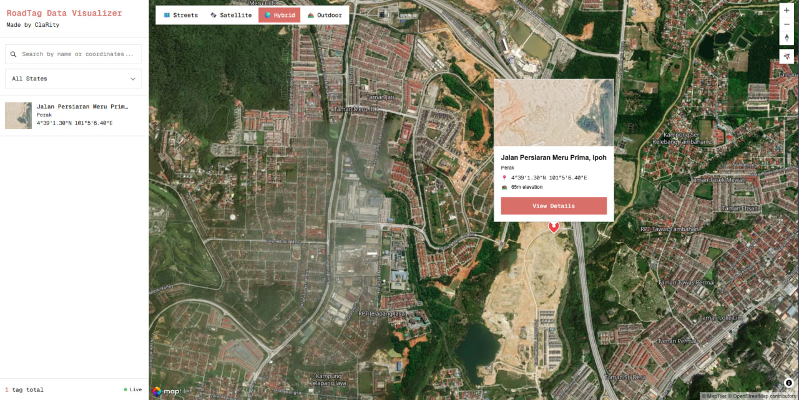
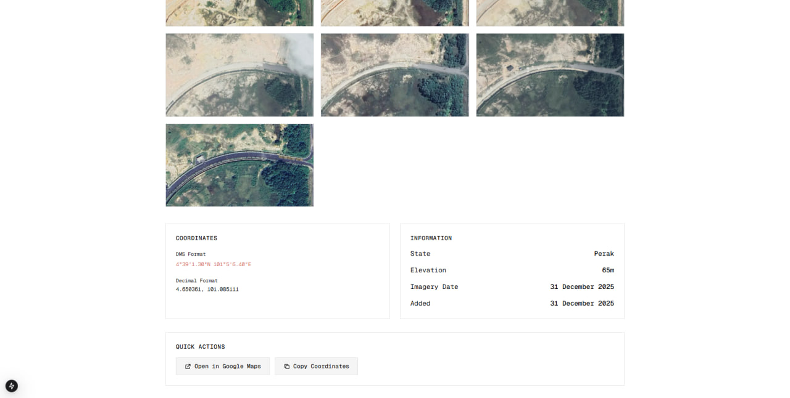
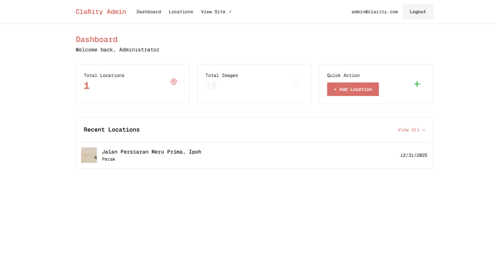
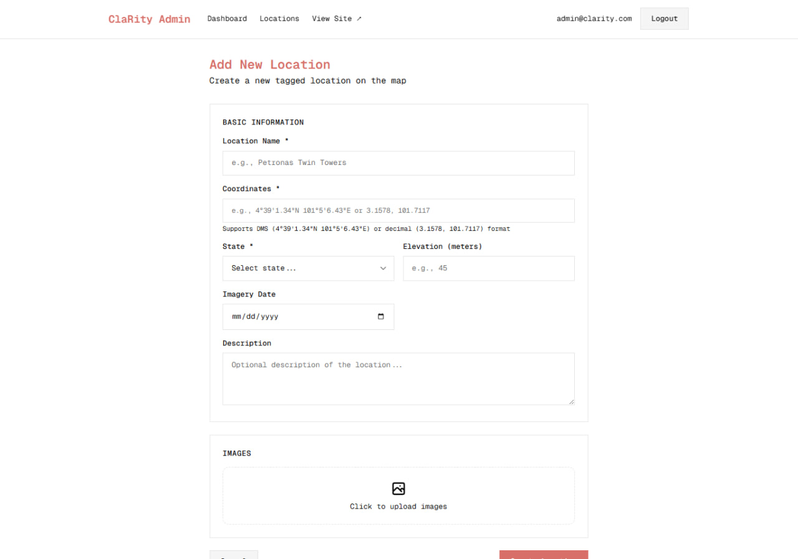
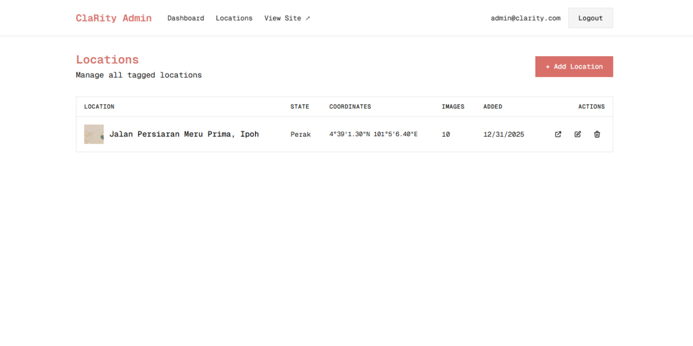

# RoadTag Data Visualizer

A modern, interactive map-based visualization tool for tagged locations. Built with Next.js 15, MapTiler SDK, and Cloudinary for image management.



## Features

- 🗺️ **Interactive Map** - MapTiler SDK with Streets, Satellite, Hybrid, and Outdoor views
- 🔍 **Search & Filter** - Search by location name or coordinates, filter by state
- 📍 **Custom Markers** - Click markers to view location details and images
- 🖼️ **Image Gallery** - Fullscreen lightbox with keyboard navigation
- 👤 **Admin Dashboard** - Full CRUD operations for managing locations
- 🔐 **Authentication** - Secure admin login with NextAuth.js
- ☁️ **Cloud Images** - Cloudinary integration for image uploads
- 🗄️ **Serverless Database** - Neon Postgres with Prisma ORM

## Screenshots

| Map View | Location Details |
|----------|------------------|
|  |  |

| Image Lightbox | Admin Dashboard |
|----------------|-----------------|
|  |  |

| Add Location |
|--------------|
|  |

## Tech Stack

| Category | Technology |
|----------|------------|
| Framework | Next.js 15 (App Router, Turbopack) |
| Database | Neon Postgres + Prisma ORM |
| Maps | MapTiler SDK JS |
| Images | Cloudinary + next-cloudinary |
| Auth | NextAuth.js v5 |
| Styling | Tailwind CSS + CSS Variables |
| Font | Geist Mono |
| Testing | Vitest + Playwright |

## Getting Started

### Prerequisites

- Node.js 18+
- npm or yarn
- Neon Postgres account
- MapTiler API key
- Cloudinary account

### Installation

1. **Clone the repository**
   ```bash
   git clone https://github.com/yourusername/clarity-roadtag-visualize.git
   cd clarity-roadtag-visualize
   ```

2. **Install dependencies**
   ```bash
   npm install
   ```

3. **Set up environment variables**
   
   Create a `.env.local` file:
   ```env
   # Neon Database
   DATABASE_URL="postgresql://..."
   
   # MapTiler
   NEXT_PUBLIC_MAPTILER_API_KEY="your-maptiler-key"
   
   # Cloudinary
   NEXT_PUBLIC_CLOUDINARY_CLOUD_NAME="your-cloud-name"
   CLOUDINARY_API_KEY="your-api-key"
   CLOUDINARY_API_SECRET="your-api-secret"
   NEXT_PUBLIC_CLOUDINARY_UPLOAD_PRESET="your-upload-preset"
   
   # NextAuth
   NEXTAUTH_SECRET="generate-with-openssl-rand-base64-32"
   NEXTAUTH_URL="http://localhost:3000"
   
   # Admin credentials
   ADMIN_EMAIL="admin@example.com"
   ADMIN_PASSWORD="your-secure-password"
   ```

4. **Set up database**
   ```bash
   npx prisma db push
   npm run db:seed
   ```

5. **Run development server**
   ```bash
   npm run dev
   ```

6. **Open** [http://localhost:3000](http://localhost:3000)

## Project Structure

```
src/
├── app/
│   ├── admin/           # Admin pages (dashboard, locations, login)
│   ├── api/             # API routes
│   ├── location/[id]/   # Location detail page
│   └── page.tsx         # Main map view
├── components/
│   ├── Admin/           # Admin components
│   ├── Map/             # Map components
│   ├── Sidebar/         # Sidebar components
│   └── ...
└── lib/
    ├── auth.ts          # NextAuth configuration
    ├── prisma.ts        # Prisma client
    ├── coordinates.ts   # Coordinate parsing utilities
    └── constants.ts     # App constants
```

## Scripts

| Command | Description |
|---------|-------------|
| `npm run dev` | Start development server |
| `npm run build` | Build for production |
| `npm run start` | Start production server |
| `npm run test` | Run unit tests |
| `npm run test:e2e` | Run E2E tests |
| `npm run db:seed` | Seed database with sample data |

## Default Admin Login

After running the seed script:
- **Email:** `admin@clarity.com`
- **Password:** `admin123`

> ⚠️ Change these credentials in production!

## API Endpoints

| Method | Endpoint | Description |
|--------|----------|-------------|
| GET | `/api/locations` | List all locations |
| POST | `/api/locations` | Create location (auth required) |
| GET | `/api/locations/[id]` | Get single location |
| PUT | `/api/locations/[id]` | Update location (auth required) |
| DELETE | `/api/locations/[id]` | Delete location (auth required) |

## License

MIT

## Made by

**ClaRity**
